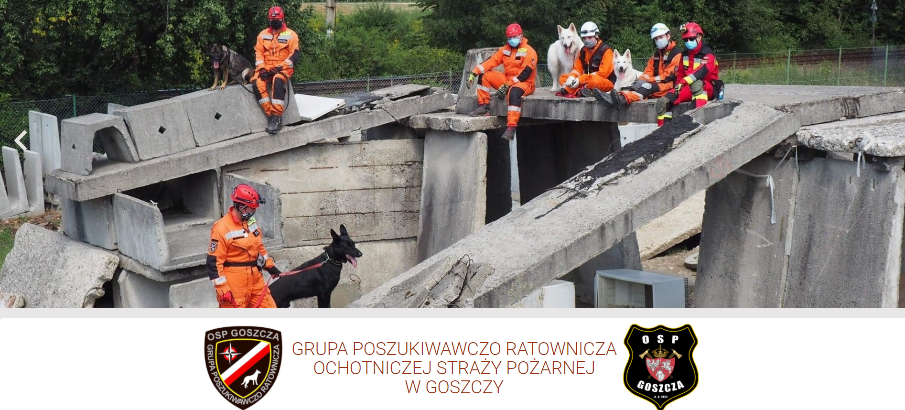
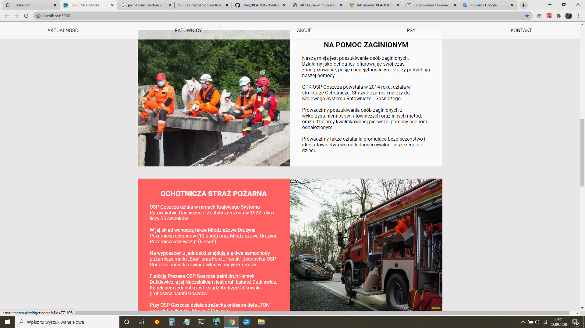
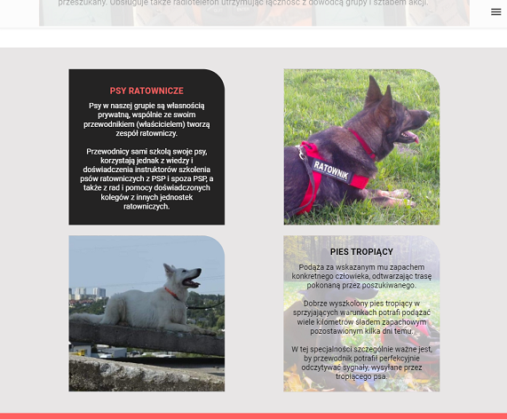
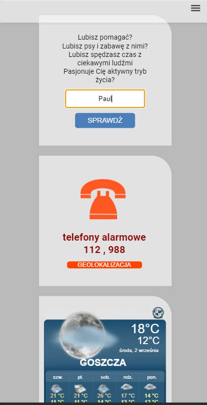

# Search and Rescue group of Volunteer Fire Departnet in Goszcza - website.
# Project Name
A website of a volunteer Search and Rescue Group of a volunteer Fire Grigade in Goszcza, in southern Poland. 

The members of the group organize search and rescue operations as well as associate and train volunteers in search and rescue techniques. 

The website is an exploit of the group, it contains all the important information about its activities, such as a description of the group, contact details, types of rescuers and rescue dogs with whom they work. 

In addition to this information, the user will also find useful information on the website, such as links to the group and fire brigade fun-pages, active emergency telephone numbers, user geolocation or a widget with weather forecast for Goszcza. 

There is also a popup on the website in which, after entering the name, the user is encouraged to join the group. 

## Table of contents
* [General info](#general-info)
* [Screenshots](#screenshots)
* [Technologies](#technologies)
* [Features](#features)
* [Status](#status)
* [Contact](#contact)

## General info

The Search and Rescue Group from Goszcza operates on a voluntary basis. In actions, they supports the police in difficult and important situations for human life.

To support the activities of the group, it is necessary to promote it and inform about the possibility of joining the group by new volunteers. The website will support the group in these processes.
The project is a form of thanks for the hard work of the group members.

The project is written in React components, code with style is in partials imported to the main scss file. Website is responsive and keep the mobile first principle.

## Screenshots
* opening section

 

* info section

 

*tablet verfion

   

* mobile version

 

## Technologies
* JavaScript ES6
* React, JSX
* SCSS
* HTML 5
* CSS
* JSON
* Markdown

## Features
To-do list in future:
* website management panel
* current event section
* form for volunteers
* gallery
* slider animation

## Status
Project is in progress. The website was created as part of the final front-end bootcamp project.

## Contact
Created by [Katarzyna Danecka-Zapała]( :https://github.com/KatarzynaZapala) - feel free to contact me!